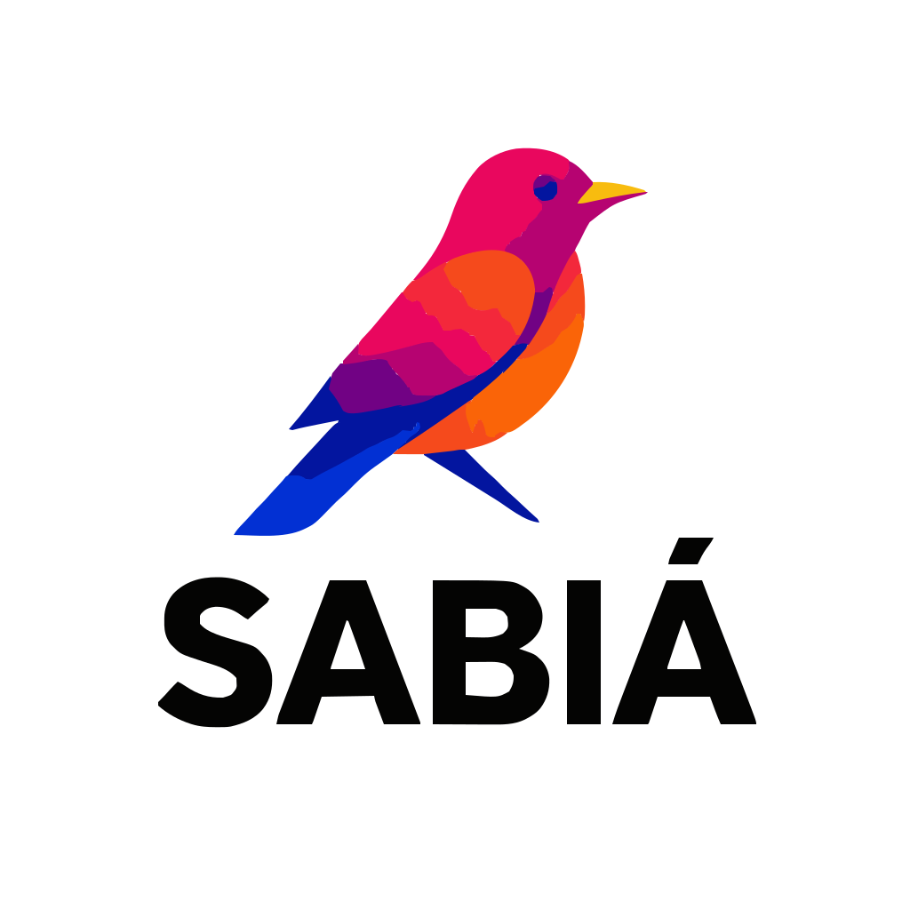

<p align="center">
  <picture>
    <source media="(prefers-color-scheme: dark)" srcset="client/public/sabia-logo.svg">
    
  </picture>
</p>

# Sabiá

Self-hosted flight logging for Microsoft Flight Simulator 2020/2024 and FSX.
Sabiá records flight tracks and statistics in a local SQLite database
and presents them in a React web application.

This repository has two parts:

- an Express and TypeScript server in `src/`;
- a React and Vite web client in `client/`, built on IBM's Carbon Design
  System.

Simulators connect through the Sabiá MCDU client, a separate Windows app
developed at [oshogun/sabia_mcdu](https://github.com/oshogun/sabia_mcdu).

**Full documentation lives in [`docs/`](docs/index.md).** This README is
just enough to get a working install.

## Prerequisites

- Node.js **24** (pinned by `.nvmrc`)
- npm
- MSFS 2020/2024 or FSX on Windows, to actually log flights
- Docker and Docker Compose, if using the container install

```bash
nvm install
nvm use
```

## Quickstart

```bash
git clone git@github.com:oshogun/sabia.git
cd sabia
npm install
cd client && npm install && cd ..

npm run build
npm run set-password
```

Set a shared ingest token (the MCDU client needs the same value):

```bash
export INGEST_TOKEN="$(openssl rand -hex 24)"
```

For anything beyond loopback access, configure HTTPS — the server refuses
plaintext HTTP on a non-loopback bind by default:

```bash
export TLS_CERT_FILE=/path/to/cert.pem
export TLS_KEY_FILE=/path/to/key.pem
npm start
```

The server listens on port `3000`. See [`docs/setup.md`](docs/setup.md) for
generating a self-signed cert and [`docs/configuration.md`](docs/configuration.md)
for every environment variable.

### Development

```bash
export BIND_HOST=127.0.0.1
export INGEST_TOKEN=devtoken1234567890
npm run dev
```

Open `http://localhost:5173` — Vite proxies API requests to the server on
port `3000`.

### Production

```bash
npm run build
npm start
```

Re-run `npm run build` after pulling application changes. When a pull
changes `client/package.json` (as the move to Carbon did), run `npm ci` in
`client/` first.

## Connect the simulator

Install and run the
[Sabiá MCDU client](https://github.com/oshogun/sabia_mcdu) on the Windows PC
with MSFS 2020/2024 or FSX. On its `CFG NETWORK` page, enter the server URL
(`https://<server-address>:3000`) and the server's `INGEST_TOKEN`. Choose the
simulator on `CFG SIM`, then press `START>` on `STATUS`. Full setup is in
that repository's
[configuration guide](https://github.com/oshogun/sabia_mcdu/blob/main/docs/configuration.md).

## Docker

An alternative to the source install above. Create the bind-mount targets
first (`touch flights.db`, `mkdir -p flight_plans navdata`), or Compose creates a
directory named `flights.db` instead of using it as a file. Full steps,
including creating the operator account inside the container:
[`docs/setup.md#docker`](docs/setup.md#docker).

## Test and verify

```bash
npm run build
npm run test:types
npm test
```

CI runs these checks on every push and pull request.

## Backups

```bash
npm run backup
```

Do not copy an open `flights.db` by itself — WAL data may not yet be in the
main file. Full backup/restore guidance:
[`docs/operations.md#backups`](docs/operations.md#backups).

## Documentation

- [Documentation home](docs/index.md)
- [Navdata on the maps](docs/navdata.md)
- [Architecture](docs/architecture.md)
- [Setup](docs/setup.md)
- [Configuration](docs/configuration.md)
- [Usage](docs/usage.md)
- [API reference](docs/api.md)
- [Data model](docs/data-model.md)
- [Operations](docs/operations.md)
- [Troubleshooting](docs/troubleshooting.md)
- [Development](docs/development.md)
- [Security](docs/security.md)

The [Sabiá MCDU client](https://github.com/oshogun/sabia_mcdu) is the
supported way to connect a simulator. The Node.js SimConnect agent that used
to live in `agent/` was retired on 2026-09-25. Its settings map one-to-one to
MCDU settings, as that repository's configuration guide describes.

## License

GPL-3.0 — see [`LICENSE`](LICENSE).
